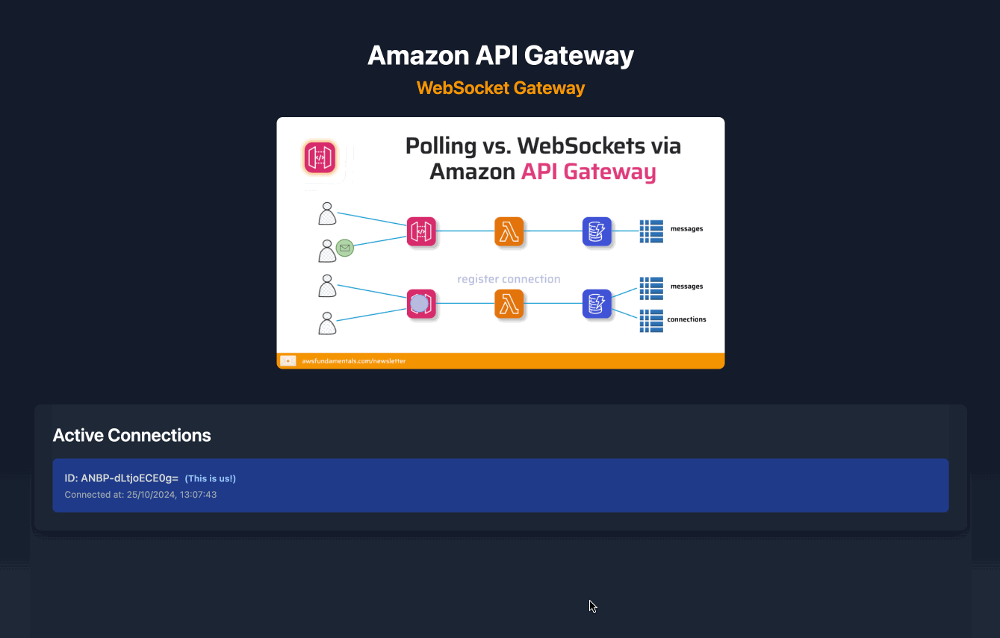

# Amazon API WebSocket Gateway Demo



This project demonstrates the use of Amazon API WebSocket Gateway using SST (Serverless Stack) v3.

## Getting Started

To run this application, follow these steps:

1. Ensure you have Node.js installed on your system.
2. Clone this repository to your local machine.
3. Install the dependencies by running `pnpm i` in the project root directory.
4. Start the development server by running:

   ```
   npx sst dev
   ```

This command will deploy the application to your AWS account and start the local development environment.

## About the Project

This application is built using SST v3, which provides a powerful framework for building serverless applications.

It showcases Amazon API WebSocket Gateway for real-time communication.

The app allows you to send messages to a WebSocket Gateway and observe the messages in real-time.
This is also true for the other way around.


## Project Structure

- `sst.config.ts`: SST configuration file
- `app/page.tsx`: Main Next.js page for the frontend
- `functions/connection.ts`: Function handling the WebSocket connection
- `functions/cron.ts`: Function that regularly sends the own connection ID to the connection clients
- `functions/api.ts`: Function to retrieve all connected clients

## Learn More

To learn more about SST and how to use it for serverless development, check out the [SST documentation](https://docs.sst.dev/).
